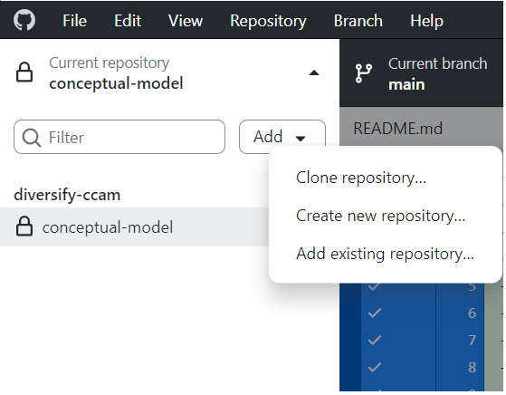
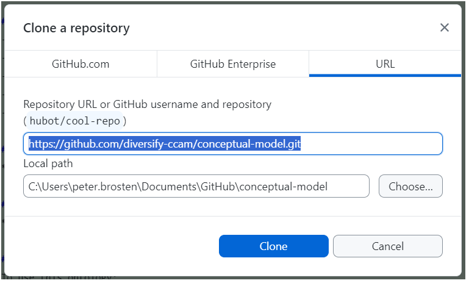
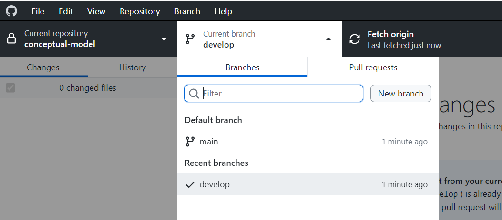
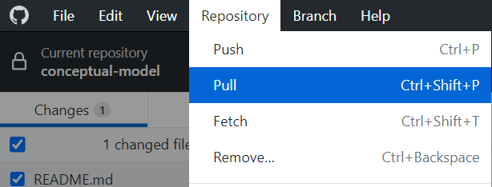
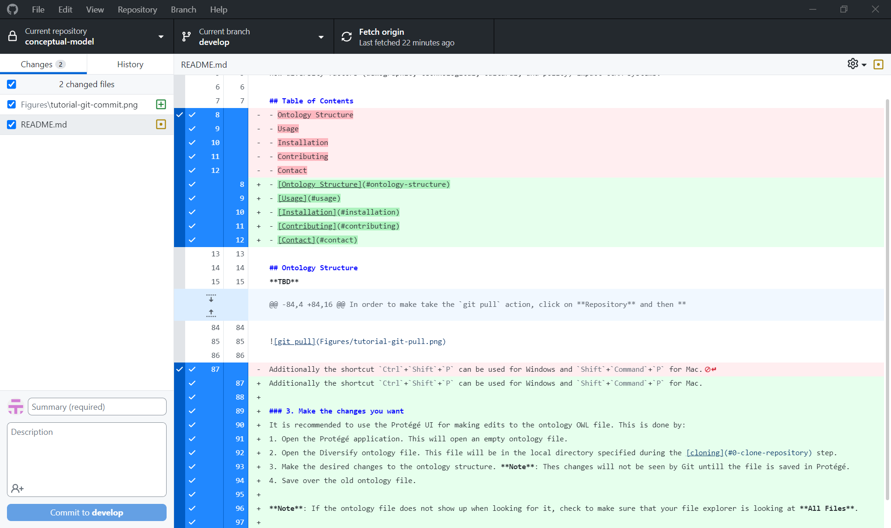
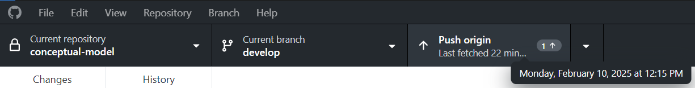

# DIVERSIFY-CCAM Ontology
## Overview
This repository develops an ontology for diversity aspects in Cooperative, Connected,
and Autonomous Mobility (CCAM). It provides a conceptual framework for understanding
how diversity factors (demographic, technological, cultural, and policy) impact CCAM systems.

## Table of Contents
- [Ontology Structure](#ontology-structure)
- [Usage](#usage)
- [Installation](#installation)
- [Contributing](#contributing)
- [Contact](#contact)

## Ontology Structure
**TBD**

## Usage
**TBD**

## Installation
To use this ontology:
1. Clone the repository:
```
git clone https://github.com/diversify-ccam/conceptual-model.git
```
2. Open the ontology in [Protégé](https://protege.stanford.edu/).

### Protégé
It is recommended that the Protégé software be used for the editing and development
of the conceptual model. Protégé Desktop can be installed [here](https://protege.stanford.edu/software.php#desktop-protege)
and an installation guide is available [here](http://protegeproject.github.io/protege/installation/).

Additional information can be found in the [Protégé wiki](https://protegewiki.stanford.edu/wiki/Main_Page).

### GitHub Desktop
For those unfamiliar or uncomfortable with using ``git`` CLI commands, it is recommended 
to use [GitHub Desktop](https://github.com/apps/desktop). The desktop application can
be downloaded [here](https://desktop.github.com/download/). 

For those interested, GitHub has extensive [documentation](https://docs.github.com/en/get-started).

## Contributing
### Prerequisites
- **GitHub Account**
- **GitHub Desktop**
- **Protégé**

### Workflow
0. [Clone repository](#0-clone-repository)
1. [Check current branch is develop](#1-check-current-branch)
2. [Pull latest project updates](#2-pull-to-update-to-current-files)
3. [Make changes in Protégé](#3-make-the-changes-you-want)
4. [Commit changes to GitHub](#4-commit-changes-in-github)
5. [Push changes to repository](#5-push-changes-to-shared-repository)

### 0. Clone repository
**This only needs to be done when setting up GitHub Desktop the first time.**

**Cloning** a Git repo means you're copying the entire project (files, history, branches)
to your local machine and setting up a connection to the remote repository so you can sync changes easily.

This is can be done using the GitHub Desktop by clicking on **Current repository**,
then **Add**, then **Clone repository...**.



This will open a popup window where you can enter the Git repo URL to be cloned and specify
the local directory it should be cloned to.



### 1. Check current branch
A Git **branch** is a separate workspace that allows you to make changes in isolation from the main code.
In this work we will use two branches:

1. `main`, which serves as the stable version of the Diversify ontology, and
2. `develop` which serves as the development workspace for future versions of the ontology.

When editing the ontology file, make sure you are currently working in the ``develop`` branch.
This can be seen by looking at the **Current branch** drop down menu.



The `develop` branch will be periodically merged into the `main` branch, resulting in an updated
version of the Diversify ontology.

### 2. Pull to update to current files
It is best practice to **pull** the most recent changes your working branch before making new changes.
This will update files in your local directory according to any changes made since you last edited.

In order to make take the `git pull` action, click on **Repository** and then **Pull**.



Additionally the shortcut `Ctrl`+`Shift`+`P` can be used for Windows and `Shift`+`Command`+`P` for Mac.

### 3. Make the changes you want
It is recommended to use the Protégé UI for making edits to the ontology OWL file. This is done by:
1. Open the Protégé application. This will open an empty ontology file.
2. Open the Diversify ontology file. This file will be in the local directory specified during the [cloning](#0-clone-repository) step.
3. Make the desired changes to the ontology structure. **Note**: Thes changes will not be seen by Git untill the file is saved in Protégé.
4. Save over the old ontology file.

**Note**: If the ontology file does not show up when looking for it, check to make sure that your file explorer is looking at **All Files**.

### 4. Commit changes in GitHub
Once the ontology file is saved, all modifications should now appear in the GitHub Desktop UI.
The following image shows an example of what might be seen.



On the left side of the screen we see a list of all changed files since the last update.
An orange icon is used to indicate that a modification to the files contents was made and a green icon
shows that the file is did not previously exist. In the main screen the line-by-line differences
are shown between the new version and the version from the last `pull`.

Everything shown in this screen is now considered **tracked** by GitHub. They will need to be **committed**
along with a **commit message** summarizing what specific changes were made during this commit.
In GitHub, this message can be written in the bottom left corner of the screen. The **Summary** field is required, whereas the 
**Description** field is optional and can be used if more detail is required.

It is best practice to make your **commit message** (the contents of the summary field) to be descriptive without being overly verbose.
Example messages could be:
```
Add new "AutonomousVehicle" class to ontology
```
```
Add "hasLocation" object property to track vehicle locations
```
```
Rename "VehicleType" class to "TransportMode" for better clarity
```
```
Update "hasModel" property to include additional vehicle types
```
```
Correct annotation for "hasDriver" property to clarify allowed values
```
When you are ready, hit the **Commit to develop** button to finalize the changes locally.
**Note**: All changes and updates at this point only exist inside your local repository. No one else can see these changes.

### 5. Push changes to shared repository
When you are ready to add your changes to the shared repository, you can do the following:
1. **pull** again from the ``develop`` branch. This is good practice as another user may
have made changes to files since you last pulled. This is the same process as [earlier](#2-pull-to-update-to-current-files).
2. If there are not conflicts, **push** your committed changes to the ``develop`` branch. This is done by using the **Push origin**
button. You will also see the number of commits that have not been added to the shared repository.



## Contact
For questions or more information, please reach out:
- Peter Brosten
- [peter.brosten@eurecat.org]